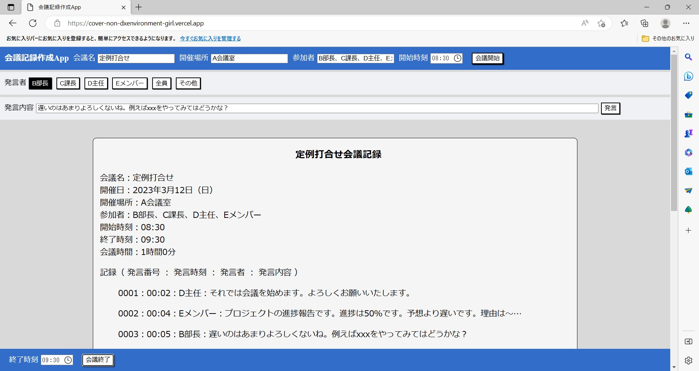

# Cover-non-DXenvironment-Girl

会議記録作成アプリです。

<<<<<<< HEAD
・Word が入っていない  
・音声認識アプリは使えない  
・ネットにつながっていない

という非 DX 環境で会議記録を作るために作成しました。  
普段はネットにつながっている PC なので  
ブラウザ表示ならいけるかな？と思いつつ。

---
=======
・Wordが入っていない  
・音声認識アプリは使えない  
・ネットにつながっていない

という非DX環境で会議記録を作るために作成しました。  
普段はネットにつながっているPCなので  
ブラウザ表示ならいけるかな？と思いつつ。

---  
使用方法
1. 会議名、開催場所、参加者（複数の場合は全角「、」で区切る）、  
開催時刻を入力後、会議開始ボタンを押す。
2. 発言者を選択して発言内容を入力後、発言ボタンを押す。
3. 会議終了後、終了時刻を入力して会議終了ボタンを押す。
4. 会議記録以下の文章をコピーして任意のソフトに張り付けて保存する。
>>>>>>> 50ceca6ec44fbd8ed93205d39996913355ae888e

使用方法

<<<<<<< HEAD
1. 会議名、開催場所、参加者（複数の場合は全角「、」で区切る）、  
   開催時刻を入力後、会議開始ボタンを押す。
2. 発言者を選択して発言内容を入力後、発言ボタンを押す。
3. 会議終了後、終了時刻を入力して会議終了ボタンを押す。
4. 会議記録以下の文章をコピーして任意のソフトに張り付けて保存する。

---

使用例

---

girl でもなんでもないのですが
Cover Girl という曲が好きなのでこれにしました( ´∀ ｀ )
=======
---  

使用例  

---  
girlでもなんでもないのですが
Cover Girlという曲が好きなのでこれにしました( ´∀｀ )
>>>>>>> 50ceca6ec44fbd8ed93205d39996913355ae888e
